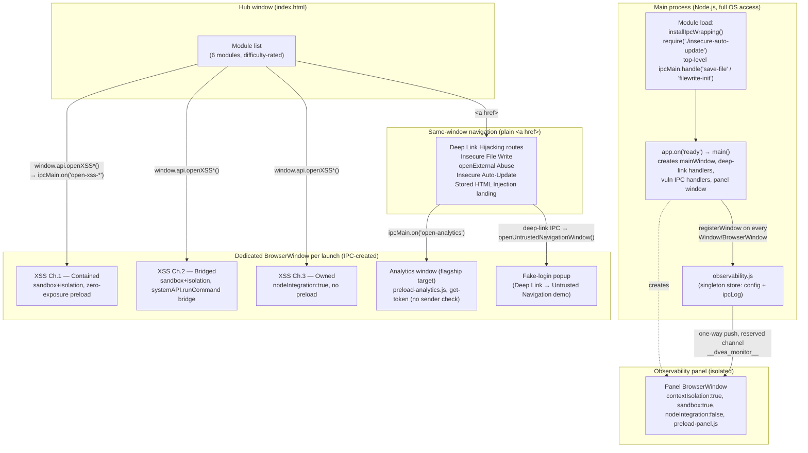
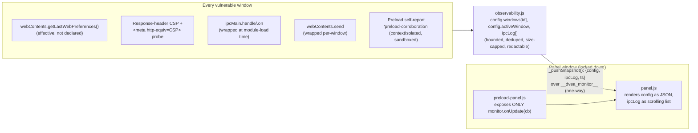

# DVEA architecture

This diagram reflects the app as it actually runs (`src/main/main.js`), not an idealized version.
It covers three things: how the hub launches modules, how the observability store is fed, and how
the panel stays isolated from the vulnerable surface it watches.

## Boot & module launch

## Observability data flow

## Why this design matters for the training goal

- **The panel cannot be reached from the vulnerable surface.** It has no exposed IPC handlers of
  its own to invoke, `contextIsolation`/`sandbox` on, and its only inbound data is a one-way push
  over a channel (`__dvea_monitor__`) that every wrap explicitly excludes from its own logging (no
  feedback loop). Compromising any demo window does not give you a path into the panel process.
- **Config Inspector reads ground truth, not configuration intent.** It reads
  `getLastWebPreferences()` — what Electron actually applied — which is what lets students see,
  live, that "declared `sandbox: true`" and "effective `sandbox: true`" are not automatically the
  same thing (see the README's chrome-sandbox troubleshooting note).
- **The IPC Monitor blind spot was a real bug, now fixed.** `ipcMain.handle`/`.on` are monkey-patched
  once, idempotently, at module load — *before* `insecure-auto-update.js` and the trailing
  `save-file`/`filewrite-init` handlers register. Node captures a reference to the unwrapped
  function the instant a handler binds, so installing the wrap any later (e.g. inside the
  `'ready'` handler) would have left those modules permanently invisible to the monitor.
- **Two launch shapes, one hub.** Most modules are same-window navigations (`<a href="module.html">`);
  a few (the three XSS challenges, the analytics window, the fake-login popup) are dedicated
  windows created by main in response to an IPC call. Both shapes register with the observability
  store the same way — through `Window`'s constructor for windows built with that helper, or via
  the global `browser-window-created` listener for windows created with a bare `new BrowserWindow(...)`.

See `CLAUDE.md` in the repo root for the full per-module breakdown this diagram summarizes.
